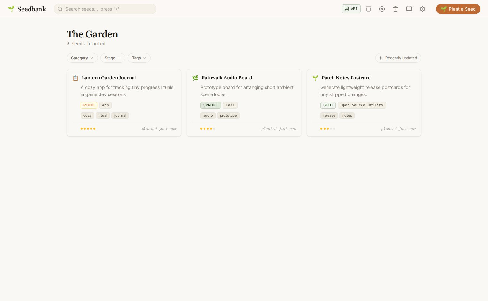
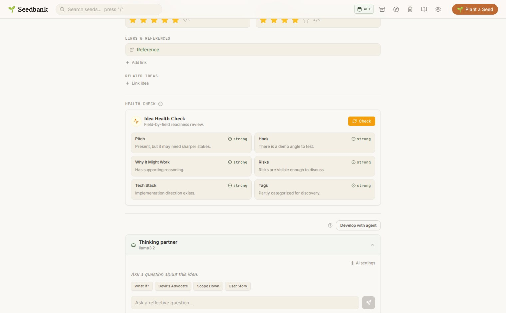
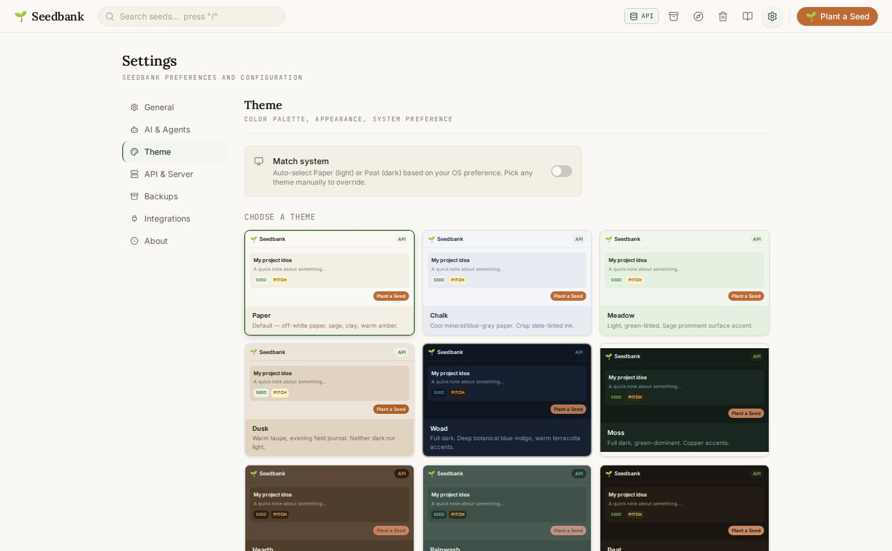
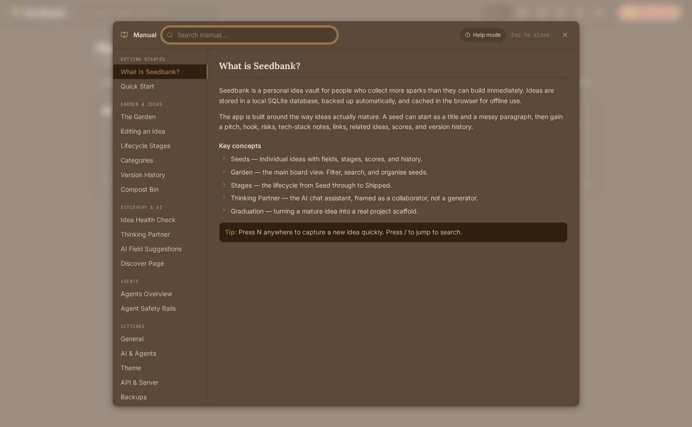
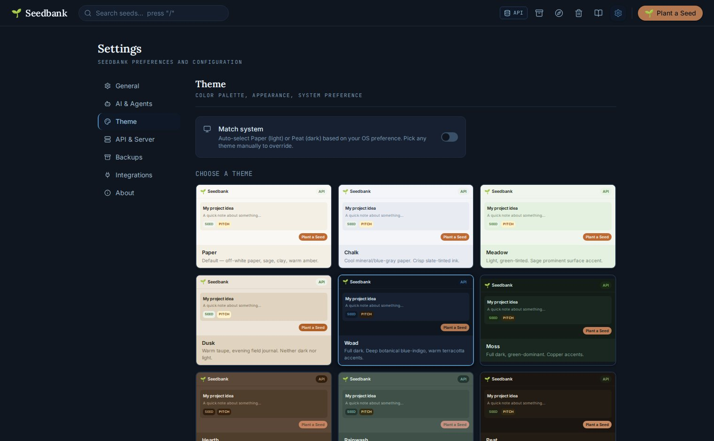
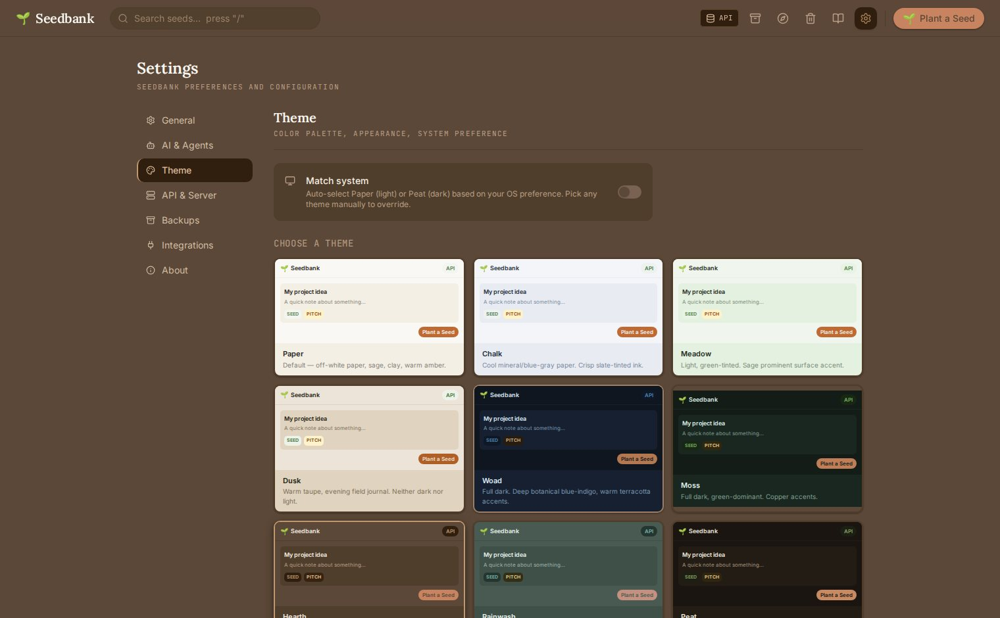

# 🌱 Seedbank
> A permanent idea vault that helps rough project sparks survive, grow, and graduate into real work.

## What is Seedbank?

Seedbank is a **local-first, single-user app** you run on your own computer. It is not a hosted service or a SaaS product — your data stays on your machine unless you explicitly export it, configure a cloud AI provider, or add an offsite backup destination.

Ideas are stored in a local SQLite database (`<seedbank-data-dir>/seedbank.db`). SQLite is the durable source of truth. Browser storage (IndexedDB) is used as a read-through cache for fast loads, an offline fallback when the server is unreachable, and a migration path for any ideas created before the backend was available. If you clear browser storage, your ideas are safe in the database.

The app is built around the way ideas actually mature. A seed can start as a title and a messy spark, then gain Concept, The Case, Elevator Pitch, Risks, Build Notes, Aesthetic direction, links, images, related ideas, scores, and version history. When an idea is ready, Seedbank can graduate it into a project scaffold via an adapter plugin.

Seedbank also includes AI-assisted development. The AI is deliberately framed as a thinking partner: it asks questions, reflects patterns, runs health checks, and helps scope ideas down. It does not try to replace your taste or generate a pile of generic ideas.

## Screenshots

Real app surfaces captured with deterministic demo data:








## Quick Start

For release archives, use the installer in the extracted Seedbank folder:

- Linux: `bash Install-Seedbank.sh`
- macOS: double-click `Install-Seedbank.command`
- Windows: double-click `Install-Seedbank.bat`

The installer checks Node.js/npm, offers an automatic install path when the OS has a supported package manager, installs Seedbank dependencies, creates an application launcher, and starts Seedbank.

For a development checkout, prerequisites are:

- Node.js 18+
- npm

```bash
git clone https://github.com/ghreprimand/Seedbank.git
cd Seedbank
bash Install-Seedbank.sh
```

On Windows PowerShell, use:

```powershell
.\Install-Seedbank.bat
```

Open `http://localhost:5173`.

The API server runs on `http://localhost:4800`.

Manage the local instance (Linux/macOS):

```bash
npm run status   # show URL, API, pid, and log path
npm run logs     # tail launcher log output
npm stop         # stop both server and client
```

Windows equivalents:

```powershell
powershell -ExecutionPolicy Bypass -File scripts/seedbank.ps1 status
powershell -ExecutionPolicy Bypass -File scripts/seedbank.ps1 stop
powershell -ExecutionPolicy Bypass -File scripts/seedbank.ps1 logs
```

On Linux/macOS (bash launcher), if port `5173` is occupied the launcher will pick the next free client port. Windows launchers fail fast on occupied ports; set `SEEDBANK_CLIENT_PORT` and `SEEDBANK_SERVER_PORT` before start when needed.

## Features

- **Persistent SQLite storage** — ideas live in `<seedbank-data-dir>/seedbank.db`, not only in browser storage.
- **Version history** — meaningful edits create snapshots that can be inspected and restored.
- **Lifecycle intelligence** — stage transitions are timestamped and shown as a per-idea timeline (Seed → Sprout, etc.) so promotion timing is visible.
- **Progressive disclosure + readiness nudges** — early-stage ideas stay lightweight, later-stage fields unlock as ideas mature, and stage-aware readiness checklists show exactly what to complete next.
- **Stages board view** — switch between Grid and Stages in the Garden; drag cards across stage swim lanes (with touch-friendly tap-to-move fallback).
- **AI thinking partner** — chat, field suggestions, organic prompt modes, health checks, and archive insights.
- **Stage-aware AI prompts** — Thinking Partner and field-assist tone adapts to the idea stage (exploratory early, sharpening at Bloom, practical at build stages, reflective for Dormant/Market states).
- **Landscape analysis** — structured AI viability scan (alternatives, gaps, demand signals, positioning, overall viability) available from Seed stage onward.
- **Landscape report persistence** — analyses are stored and reloaded per idea, so viability research becomes durable reference material.
- **Image gallery at Plot stage** — upload, browse, lightbox, and delete image references as ideas move into concrete visual identity work.
- **Ten runtime themes** — Paper, Chalk, Meadow, Dusk (light), Hearth, Rainwash (mid-depth), and Woad, Moss, Peat, Canopy (dark); switchable live from Settings → Theme, with system dark/light auto-pairing (Paper ↔ Peat).
- **Settings page** — a permanent `/settings` home for every configuration option: AI providers, feature routing, theme, API tokens, webhooks, backups, project graduation, and app info.
- **Contextual help mode** — bottom-right help control toggles click-anywhere contextual guidance across pages, settings, and modals, with deep links into the in-app manual.
- **Account reauth notice** — if Claude or Codex account auth was previously working in this browser and later requires sign-in again, a persistent notice links straight to Settings → AI & Agents.
- **Personal access tokens** — generate scoped bearer tokens (`read:ideas`, `write:ideas`, `ai:suggest`, `mcp:read`) for local scripting. Tokens are hashed at rest; creation is localhost-only.
- **Outbound webhooks** — fire a JSON payload to any URL on `idea.created`, `idea.graduated`, or `idea.shipped`. Useful for Zapier, n8n, or local automation.
- **Read-only MCP endpoints** — `/api/mcp/ideas`, `/api/mcp/ideas/:id`, and `/api/mcp/search` expose seeds as context for external Claude or Codex sessions; token-gated.
- **OpenAPI spec** — machine-readable at `/api/openapi.json`; browsable from Settings → API & Server.
- **Project drafting** — generate reviewable starter files such as specs, implementation notes, and TODOs from an idea using the same configurable AI provider/model/effort routes as the other assist features; save reviewed files into a graduated project path when configured.
- **Project graduation** — turn a mature idea into an external project scaffold via project-graduation adapters.
- **Import/export** — full archive export to JSON or Markdown, plus import from Seedbank archives and Markdown.
- **Compost bin** — deleted ideas are soft-deleted, recoverable for 30 days, then purged.
- **Auto-backups** — scheduled SQLite backups and JSON archive exports under `<seedbank-data-dir>/`.

## Platform Setup

### Linux

From a release archive or checkout:

```bash
bash Install-Seedbank.sh
```

This installs dependencies, prepares the runtime, installs a desktop launcher, and starts Seedbank. To install only the desktop launcher after setup:

```bash
bash scripts/install-desktop.sh
```

This installs:
- the launcher entry under `~/.local/share/applications/seedbank.desktop`
- the app icon under `~/.local/share/icons/hicolor/scalable/apps/seedbank.svg`

The launcher runs `scripts/seedbank start` from your cloned repository.

For auto-start, create a user systemd service that runs the launcher script from the repository root after login.

Example service shape:

```ini
[Service]
WorkingDirectory=/path/to/Seedbank
ExecStart=/usr/bin/bash /path/to/Seedbank/scripts/seedbank start
ExecStop=/usr/bin/bash /path/to/Seedbank/scripts/seedbank stop
Restart=on-failure
```

### macOS

From a release archive or checkout, double-click `Install-Seedbank.command` or run:

```bash
bash Install-Seedbank.command
```

This installs dependencies, prepares the runtime, creates `~/Applications/Seedbank.app`, and starts Seedbank. Finder/Dock launch logs are written to `~/Library/Logs/Seedbank/launcher.log`. To start manually later:

```bash
bash scripts/seedbank start
```

Use `bash scripts/seedbank stop` to stop background processes.

If macOS blocks the launcher because the archive is unsigned, run this inside the extracted folder:

```bash
xattr -rc .
```

### Windows

From a release archive, double-click `Install-Seedbank.bat`, or run:

```bat
Install-Seedbank.bat
```

This installs dependencies, prepares the runtime, creates a Start Menu shortcut, and starts Seedbank.
If Seedbank was already running from another extracted folder, the installer stops the old local Seedbank processes before starting the new copy.

Status and stop:

```powershell
powershell -ExecutionPolicy Bypass -File scripts/seedbank.ps1 status
powershell -ExecutionPolicy Bypass -File scripts/seedbank.ps1 stop
```

## Packaging Roadmap

Seedbank release archives are local web-app bundles with one user-facing installer for the target OS: `Install-Seedbank.sh` on Linux, `Install-Seedbank.command` on macOS, and `Install-Seedbank.bat` on Windows. Launchers run the built runtime (`server/dist` + `vite preview`) rather than hot-reload dev mode.

Near-term deliverables:

- `npx`/global CLI wrapper for `start|stop|status|logs` around the same local runtime model.
- Container image for trusted local/LAN self-hosting, with explicit storage volume mapping for `<seedbank-data-dir>`.
- More polished install helpers for uncommon Linux distributions and signed macOS/Windows launcher metadata.

Current release scaffolding:
- `npm run release:package` (build all archive targets)
- `npm run release:package -- --target <linux-x64|macos|windows-x64> --format <tar.gz|zip>`
- `npm run release:smoke` (smoke-check all discovered release artifacts)
- `npm run release:smoke -- <artifact-path>`
- Tag-driven GitHub workflow: `.github/workflows/release.yml` (macOS package job requires a self-hosted runner with labels `[self-hosted, macOS]`)
- Full release notes: `docs/RELEASING.md`

Public-repo runner safety note: self-hosted runners execute repository workflow code. Seedbank keeps self-hosted usage constrained to trusted release tag/manual paths, not PR/fork workflows.

Deferred packaging:

- Full desktop bundles (Tauri/Electron) are intentionally deferred. They would require native signing/notarization, auto-update strategy, and consistent cross-platform packaging CI.
- Public internet hosting is not a default target; any remote exposure needs additional auth, TLS, and network hardening beyond current defaults.

## Architecture

```text
Seedbank
├── client/   → React 19 + Vite + Tailwind CSS
├── server/   → Express + SQLite via better-sqlite3
└── shared/   → TypeScript domain types shared by both packages
```

Data flow:

```text
Browser UI ↔ REST API ↔ SQLite (<seedbank-data-dir>/seedbank.db)
     │
     └── IndexedDB via Dexie for cache and offline fallback
```

The root workspace runs both apps with one command. The client is intentionally thin: it calls the REST API first and falls back to Dexie when the backend is unavailable.

## Configuration

### Data Storage

Seedbank stores durable data in:

```text
<seedbank-data-dir>/
├── seedbank.db
├── backups/
└── exports/
```

On server startup, the current database is copied into `backups/` after migrations complete. The backup service also runs scheduled daily/weekly checks while the server is up. The retention count is configurable in Settings → Backups (default: 10). The backup UI can run manual backups, configure daily/weekly/off scheduling, toggle JSON archive exports, and validate backups with a non-destructive restore test. When JSON export backups are enabled, full archive snapshots are written to `exports/`.

The first time the backend is available, the client can migrate existing browser IndexedDB ideas into SQLite while preserving IDs, timestamps, and versions.

### AI Setup

Built-in provider methods include **OpenAI API**, **Anthropic API**, **Claude account**, **Codex account**, **Ollama / local models**, and OpenAI-compatible local/cloud endpoints. OpenRouter, Groq, Mistral, Together, Fireworks, LM Studio, vLLM, llama.cpp, LocalAI, and custom gateways can be configured in Settings → AI & Agents.

Provider settings are configured in **Settings → AI & Agents** (`/settings/ai-agents`). Local and external OpenAI-compatible services can be saved as separate provider instances, each with its own label, URL, model catalog, enabled-model subset, and health/probe status. When a provider connects, Seedbank discovers available models and stores them server-side for Feature Defaults and Ask AI routing.

Claude account and Codex account are account transports for chat/model routing: Claude uses the native OAuth login flow in Seedbank, while Codex uses the local Codex app-server auth flow. If either account was previously authenticated in this browser but the current server status later requires sign-in again, Seedbank shows a persistent reauth notice with a direct link back to Settings → AI & Agents. The browser-side reminder stores only that this browser has seen a successful account auth before; credentials stay in the server-side account transport.

Provider API keys (OpenAI, Anthropic, OpenRouter, Groq, Mistral, Together, Fireworks, or another compatible endpoint) are stored server-side, encrypted at rest; public config responses only expose whether a key exists. These are separate from **Seedbank personal access tokens** (Settings → API & Server), which are bearer tokens for the Seedbank REST API itself.

AI features include the Thinking Partner chat, contextual field suggestions, Project drafting, What If, Devil's Advocate, Scope Down, User Story, Idea Health Check, Smart Cross-Pollinate, and Pattern Insights. All AI features are opt-in. Feature Defaults choose the provider/model/effort for each feature, and the Ask AI modal lets you temporarily switch to another configured provider/model for a single run. See [docs/AI_GUIDE.md](docs/AI_GUIDE.md).

### Project Graduation

Project Graduation adapters live in `server/src/integrations/`. Seedbank is adapter-driven: the built-in generic local adapter works out of the box. Optional custom adapters can target specific local tools or external project workflows — implement the `Integration` interface, register in the registry, and graduate ideas to any local path. A graduated idea stores its destination in `graduatedTo` and advances stage automatically.

See [docs/INTEGRATIONS.md](docs/INTEGRATIONS.md) for adapter implementation details.

## API Reference

Full REST reference with request/response shapes, token auth, and webhook payloads: **[docs/API.md](docs/API.md)**.

Machine-readable OpenAPI spec: `GET /api/openapi.json`. The same spec is browsable from **Settings → API & Server → View API reference** inside the running app.

Quick endpoint groups: ideas, versions, integrations, AI (chat, suggest, project draft, usage), settings, tokens, webhooks, MCP, backups, export/import, health. See `docs/API.md` for the full list.

## Documentation

| Document | Contents |
|----------|----------|
| [docs/SETTINGS.md](docs/SETTINGS.md) | Every Settings tab explained — what's stored where, offline behavior, server vs localStorage. |
| [docs/THEMING.md](docs/THEMING.md) | Token model, the ten themes, dark-mode scale inversion, custom theme authoring. |
| [docs/API.md](docs/API.md) | Full REST reference — endpoint list, token auth, webhook payloads, MCP surface. |
| [docs/AI_GUIDE.md](docs/AI_GUIDE.md) | Thinking Partner posture, provider setup, prompt modes, field suggestions, usage readout. |
| [docs/PROJECT_DRAFTING.md](docs/PROJECT_DRAFTING.md) | Project drafting workflow, Feature Defaults routing, guardrails, and review-first file handling. |
| [docs/ARCHITECTURE.md](docs/ARCHITECTURE.md) | System diagram, data-flow, settings store, token middleware, theme tokens, AI provider routing. |
| [docs/INTEGRATIONS.md](docs/INTEGRATIONS.md) | Graduation adapter interface and built-in adapters. |
| [docs/RELEASING.md](docs/RELEASING.md) | Archive-based release flow, packaging commands, workflow notes, smoke checks. |

## Security and Hosting

Seedbank is designed for **single-user, local use only**. It is not a multi-user hosted application and does not implement user accounts or session authentication for browser clients on a shared host.

- **Default binding:** `localhost` / `127.0.0.1`. The CORS policy blocks non-loopback origins. Port `4800` is not intended to be exposed to the public internet.
- **Do not expose the API publicly** without adding a reverse-proxy that enforces authentication and TLS. Seedbank API access from `localhost` does not require a bearer token by design; public exposure without a proxy would give unauthenticated access to your ideas and data.
- **API tokens** provide scoped bearer access for local scripting. Token creation is restricted to `localhost` browser sessions even if you hold a valid token.
- **Data:** all idea content stays on your machine. AI features send idea content to your configured AI provider (OpenAI API, Anthropic API, OpenRouter / custom endpoint, or Ollama). With Ollama or a local custom endpoint, nothing leaves the configured local host.

For trusted LAN or self-hosted access, place a reverse proxy (nginx, Caddy) in front of port `4800` with HTTP basic auth or mutual TLS, and similarly protect port `5173`.

## Development

```bash
npm run dev        # client + server, hot reload (dev mode)
npm run build      # build client and server
npm run typecheck  # typecheck client and server
npm run lint       # lint client
```

Project structure:

- `client/src/pages/` — route-level screens.
- `client/src/components/` — reusable UI and workflow components.
- `client/src/api/client.ts` — browser API client with Dexie fallback.
- `client/src/db/` — IndexedDB cache/fallback implementation.
- `server/src/index.ts` — Express routes.
- `server/src/repository.ts` — SQLite data access.
- `server/src/ai/` — provider abstraction, streaming, config, and usage tracking.
- `server/src/integrations/` — graduation plugins.
- `shared/types.ts` — cross-package domain types.

To add an integration, implement the `Integration` interface, register it in the integration registry, add any needed configuration keys, and expose readiness checks that explain what an idea needs before graduation.

## License

MIT
